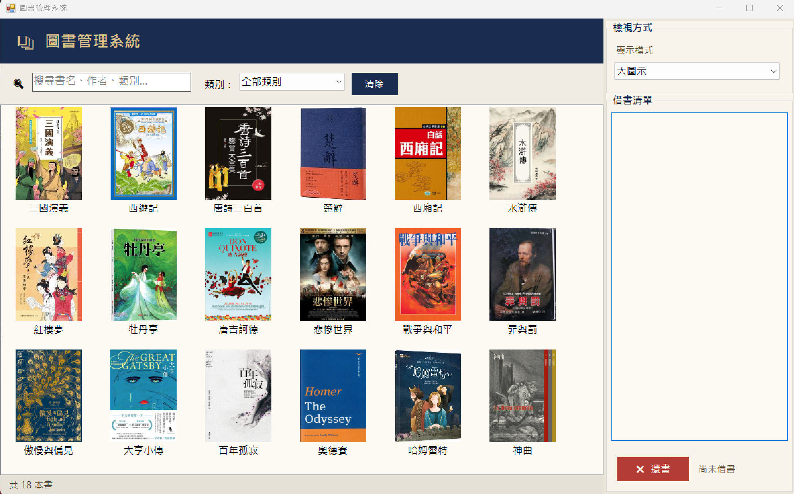

# 📚 圖書管理系統

一個以 C# Windows Forms 製作的圖書管理系統，支援多種檢視模式、即時搜尋篩選、借書與還書功能，並可自動載入書籍封面圖片。

## 📸 截圖

**主畫面**



## ✨ 功能

- **📖 書籍清單**：收錄 18 本中外經典著作，含書名、作者、類別資訊
- **🖼️ 封面顯示**：自動從 `書籍封面` 資料夾載入書籍封面圖片
- **🔍 即時搜尋**：輸入關鍵字即時過濾書名、作者或類別
- **🗂️ 類別篩選**：下拉選單依類別篩選（章回小說、戲曲、西洋小說等）
- **🖥️ 多種檢視模式**：支援大圖示、小圖示、清單、詳細資料、大圖示加詳細資料
- **📋 借書清單**：雙擊書本即可加入借書清單，並有確認提示
- **↩️ 還書功能**：在借書清單中選取後按「還書」歸還，含確認對話框
- **📊 狀態列**：底部即時顯示目前書籍總數或搜尋結果筆數

## 🛠️ 開發環境

| 項目 | 版本 |
|------|------|
| 語言 | C# |
| 框架 | .NET Framework 4.7.2 |
| UI | Windows Forms |
| IDE | Visual Studio 2022 |

## 🚀 執行方式

1. 以 Visual Studio 開啟 `BookListView.sln`
2. 建置專案（Build → Build Solution）
3. 執行（F5 或 Ctrl+F5）

## 📁 專案結構

```
BookListView/
├── Images/                          # 截圖
│   └── sample.png                   # 主畫面截圖
├── 書籍封面/                         # 書籍封面圖片
│   ├── book1.jpg ～ book18.jpg
├── BookListView/
│   ├── frmBooks.cs                  # 主要邏輯（搜尋、篩選、借還書、圖片載入）
│   ├── frmBooks.Designer.cs         # UI 控制項配置
│   ├── frmBooks.resx                # 表單資源檔
│   ├── Program.cs                   # 程式進入點
│   └── Properties/
└── BookListView.sln
```

## 📖 書籍清單

| # | 書名 | 作者 | 類別 |
|---|------|------|------|
| 1 | 三國演義 | 羅貫中 | 章回小說 |
| 2 | 西遊記 | 吳承恩 | 章回小說 |
| 3 | 唐詩三百首 | 孫洙 | 詩選 |
| 4 | 楚辭 | 劉向 | 詩歌 |
| 5 | 西廂記 | 王實甫 | 戲曲 |
| 6 | 水滸傳 | 施耐庵 | 章回小說 |
| 7 | 紅樓夢 | 曹雪芹 | 章回小說 |
| 8 | 牡丹亭 | 湯顯祖 | 戲曲 |
| 9 | 唐吉訶德 | 塞萬提斯 | 西洋小說 |
| 10 | 悲慘世界 | 維克多·雨果 | 西洋小說 |
| 11 | 戰爭與和平 | 托爾斯泰 | 西洋小說 |
| 12 | 罪與罰 | 杜斯妥也夫斯基 | 西洋小說 |
| 13 | 傲慢與偏見 | 珍·奧斯汀 | 西洋小說 |
| 14 | 大亨小傳 | 費茲傑羅 | 西洋小說 |
| 15 | 百年孤寂 | 馬奎斯 | 西洋小說 |
| 16 | 奧德賽 | 荷馬 | 古典詩歌 |
| 17 | 哈姆雷特 | 莎士比亞 | 戲曲 |
| 18 | 神曲 | 但丁 | 古典詩歌 |

## 📖 使用說明

1. 啟動程式後，書籍清單以「大圖示」模式顯示
2. 在搜尋框輸入關鍵字可即時過濾書名、作者或類別
3. 透過右側下拉選單切換顯示模式（大圖示 / 詳細資料 / 清單等）
4. 透過「類別」下拉選單縮小瀏覽範圍，按「清除」回到全部書籍
5. **雙擊**書本圖示可加入借書清單，系統會先確認再加入
6. 在借書清單中選取書名後，按「✖ 還書」可將書籍歸還

## 📄 授權

本專案採用 [MIT License](LICENSE.txt) 授權。
